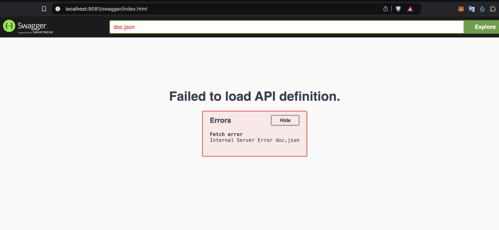

# GoWeb2 - Issue Tracking API Service

A RESTful web service built with Go and Gin framework for issue tracking management with OpenAPI 3.0 documentation.

## Features

- RESTful API endpoints for issue management
- OpenAPI 3.0 documentation with Swagger UI
- Comprehensive data model for issue tracking
- Time tracking functionality
- Priority and severity management
- Project organization

## Prerequisites

- Go 1.21 or higher
- Git

## Installation

1. Clone the repository:
```bash
git clone https://github.com/despiegk/goweb2.git
cd goweb2
```

2. Run the installation script:
```bash
chmod +x install.sh
./install.sh
```

This will install all necessary dependencies including:
- Gin web framework
- Swag for OpenAPI documentation
- Other required Go packages

## Running the Service

1. Start the service:
```bash
chmod +x start.sh
./start.sh
```

The service will be available at:
- API: http://localhost:8081/api/v1
- OpenAPI Documentation: http://localhost:8081/docs
- OpenAPI Specification: http://localhost:8081/openapi.yaml

## API Documentation

### Data Models

#### Issue Categories
- task
- story
- question
- bug
- crm

#### Issue Statuses
- new_status
- todo
- in_progress
- completed
- question
- blocked
- verified

#### Issue Priorities
- low
- medium
- high
- critical

#### Issue Severities
- normal
- high
- serious
- disaster

### Main Endpoints

- `GET /issues` - List all issues
- `POST /issues` - Create a new issue
- `GET /issues/:id` - Get issue details
- `PUT /issues/:id` - Update an issue
- `DELETE /issues/:id` - Delete an issue
- `POST /issues/:id/time` - Add time entry to an issue

## Project Structure

```
.
├── api/
│   └── v1/            # API version 1 handlers
├── docs/              # Generated OpenAPI documentation
├── internal/
│   ├── model/         # Data models
│   └── service/       # Business logic
├── pkg/               # Reusable packages
├── install.sh         # Installation script
├── start.sh          # Startup script
├── main.go           # Application entry point
└── README.md         # This file
```

## Development

To regenerate the Swagger documentation:

```bash
swag init
```

## License

MIT License
